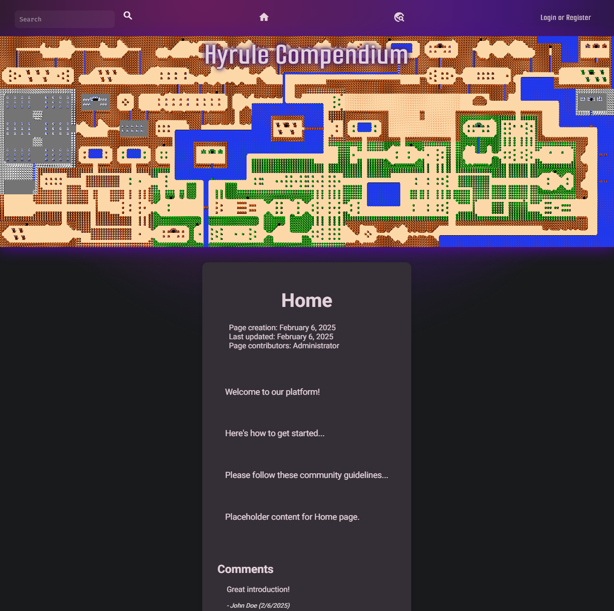
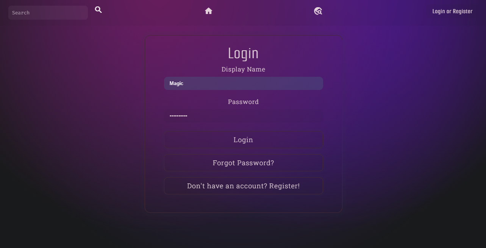
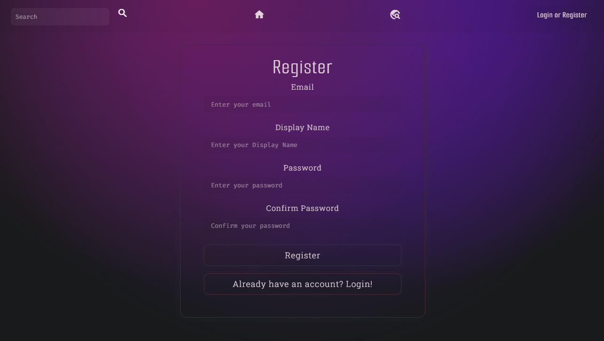
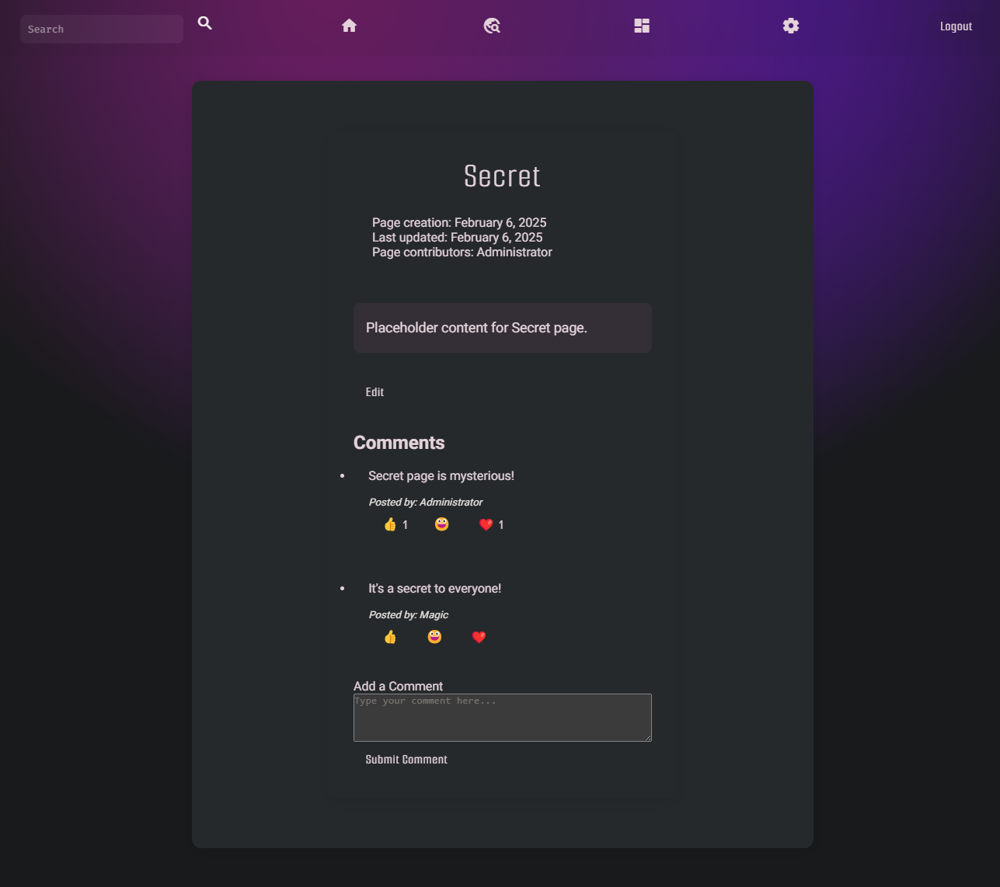
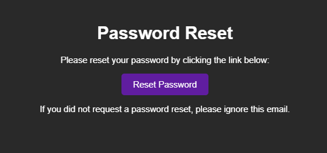

# Hyrule Compendium

An interactive wiki platform dedicated to The Legend of Zelda™, featuring user authentication, forum discussions, and collaborative content management.

## Description

The Hyrule Compendium is a full-stack web application that serves as a comprehensive knowledge base for The Legend of Zelda™ fans. With tiered user permissions, email verification, and content moderation features, it creates a secure and engaging environment for community contributions.

## Live Site
[Hyrule Compendium](https://hyrule-compendium.magicapps.dev/)

## Features

### User Authentication
- User registration with email verification
- Secure login/logout functionality
- Password reset capability
- Tiered user privileges system

### Content Management
- Wiki-style content creation and editing
- Moderation system for content approval
- Progressive edit privileges based on user contribution history
- Super user dashboard for content oversight

### Community Features
- Forum discussions with threaded comments
- Emoji reactions
- User profiles
- Content categorization

## Technology Stack

### Frontend
- **Next.js** - React framework for production
- **TypeScript** - Static typing for enhanced development
- **Custom CSS Modules** - Modular and maintainable styling
- **Responsive Design** - Mobile-first approach

### Backend
- **Node.js** with **Express** - Server framework
- **PostgreSQL** - Relational database
- **Sequelize** - ORM for database operations

## Database Schema
- Users
- Categories
- Pages
- Content
- Comments
- Reactions
- Page Categories

## Screenshots

### Homepage with Latest Updates

### Login View 

### Register View

### User Dashboard

### Article View with Comments

### Email Examples

## Team
- [Kat](https://github.com/dauntss)
- [Hailey](https://github.com/Cinnlight)
- [Brian](https://github.com/Duck-Method)
- [Jake](https://github.com/MagicInUse)

## Contributing
- This is a school project demonstrating full-stack development capabilities. While it's not open for public contributions, we welcome feedback and suggestions.

## License
This project is part of an educational program and is not licensed for commercial use.

## Acknowledgments
The Legend of Zelda™ is a trademark of Nintendo®